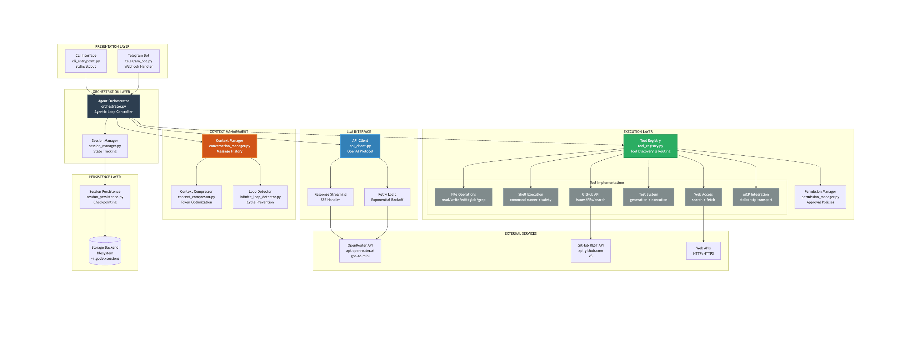

# Godel AI Agent

> A powerful, production-ready AI agent framework with autonomous tool execution, GitHub integration, auto-testing, and remote access via Telegram.

Godel is an intelligent coding assistant that can read, write, and execute code, manage your GitHub workflow, generate tests, and be controlled remotely from anywhere. Built for developers who need an AI that actually gets work done.

[](https://www.python.org/downloads/)

## Key Features

### Autonomous Agent
- **16+ Built-in Tools** - File operations, shell commands, GitHub API, web search, and more
- **Context-Aware** - Automatic conversation compression and memory management
- **Session Persistence** - Save, resume, and checkpoint conversations
- **Real-time Streaming** - Live token streaming for immediate feedback
- **Flexible Approval Modes** - From full autonomy to manual confirmation

### Auto-Testing
- **Test Generation** - Auto-generate unit tests for Python, JS, TS, Go, Rust
- **Test Execution** - Run tests with automatic framework detection (pytest, jest, etc.)
- **Failure Analysis** - Automatically analyze and suggest fixes for test failures

### GitHub Integration
- **Issue Analysis** - Fetch and analyze GitHub issues
- **PR Creation** - Create pull requests programmatically
- **Code Search** - Search code across repositories
- **Full API Access** - Complete PyGithub integration

### Remote Access
- **Telegram Bot** - Control your agent from anywhere via Telegram
- **Per-User Sessions** - Isolated conversation contexts
- **Simple Toggle** - One command to enable/disable

## Architecture



The architecture follows a modular design with clear separation of concerns:
- **Agent Orchestrator** manages the agentic loop and coordinates all components
- **Tool Registry** provides extensible tool system with 16+ built-in tools
- **Context Manager** handles conversation history and automatic compression
- **LLM Client** abstracts API communication with streaming support

## Quick Start

### Installation

```bash
# Clone the repository
git clone <your-repo-url>
cd godel

# Create virtual environment
python3 -m venv .venv
source .venv/bin/activate  # On Windows: .venv\Scripts\activate

# Install dependencies
pip install -r requirements.txt
```

### Configuration

Create a `.env` file in the project root:

```env
# Required
API_KEY=your_openai_or_openrouter_api_key
BASE_URL=https://openrouter.ai/api/v1

# Optional
GITHUB_TOKEN=your_github_personal_access_token
TELEGRAM_BOT_TOKEN=your_telegram_bot_token
TELEGRAM_ALLOWED_USERS=comma_separated_user_ids
```

**Get API Keys:**
- OpenRouter: [openrouter.ai](https://openrouter.ai/)
- GitHub Token: Settings → Developer settings → Personal access tokens
- Telegram Bot: [@BotFather](https://t.me/botfather)
- Telegram User ID: [@userinfobot](https://t.me/userinfobot)

### Usage

**Interactive Mode (Recommended):**
```bash
./run.sh
```

**One-off Command:**
```bash
python3 cli_entrypoint.py "analyze this codebase and suggest improvements"
```

**Custom Working Directory:**
```bash
python3 cli_entrypoint.py --cwd /path/to/project "your task"
```

## Commands Reference

| Command | Description |
|---------|-------------|
| `/help` | Show available commands |
| `/tools` | List all 16 available tools |
| `/config` | Display current configuration |
| `/approval <mode>` | Change approval policy |
| `/model <name>` | Switch language model |
| `/telegram` | Enable Telegram remote access |
| `/clear` | Clear conversation history |
| `/save` | Save current session |
| `/resume <id>` | Resume a saved session |
| `/checkpoint` | Create a checkpoint |
| `/restore <id>` | Restore from checkpoint |
| `/stats` | Show token usage and session stats |
| `/mcp` | Show MCP server status |
| `/exit` | Exit the agent |

## Available Tools

### File Operations
- **read_file** - Read file contents with optional line ranges
- **write_file** - Create or overwrite files
- **edit** - Make surgical edits with find/replace
- **list_dir** - List directory contents
- **glob** - Find files matching glob patterns
- **grep** - Search file contents with regex

### Shell & Execution
- **shell** - Execute shell commands with safety checks
- **run_tests** - Execute test suites with appropriate runners

### GitHub Integration
- **analyze_github_issue** - Fetch and analyze issues
- **create_pull_request** - Create PRs with title and description
- **search_github_code** - Search code across repositories

### Testing
- **generate_tests** - Auto-generate unit tests
- **run_tests** - Execute and analyze test results

### Web Access
- **web_search** - Search the web for information
- **web_fetch** - Fetch and extract content from URLs

### Utilities
- **todos** - Manage task lists
- **memory** - Persistent key-value storage

## Telegram Bot

Access your agent remotely from anywhere via Telegram.

### Setup

1. Create a bot with [@BotFather](https://t.me/botfather)
2. Get your user ID from [@userinfobot](https://t.me/userinfobot)
3. Add credentials to `.env`
4. Start interactive mode: `./run.sh`
5. Type: `/telegram`

The bot starts and you can message it on Telegram. Press **Enter** in the CLI to stop.

### Bot Commands
- `/start` - Initialize your session
- `/clear` - Clear conversation history
- `/status` - Show session information
- `/help` - Show help message

## Usage Examples

### GitHub Workflow
```
Analyze issue #123 in owner/repo, search the codebase for relevant files,
create a fix, and prepare a pull request with tests
```

### Auto-Testing
```
Generate comprehensive unit tests for src/utils/parser.js using jest,
then run the tests and fix any failures
```

### Code Refactoring
```
Refactor the User class in src/models/user.py to follow SOLID principles,
update all imports, and run the test suite
```

### Web Research + Implementation
```
Search for best practices for JWT authentication in Node.js,
then implement it in our Express app with proper error handling
```

## Safety & Approval Policies

Control how much autonomy the agent has:

| Policy | Description | Use Case |
|--------|-------------|----------|
| `yolo` | Auto-approve everything | Demo, trusted environments |
| `auto` | Auto-approve reads, confirm writes | Development work |
| `auto-edit` | Auto-approve edits, confirm new files | Refactoring |
| `on-request` | Confirm each mutating operation | Sensitive codebases |
| `never` | Block all mutating operations | Read-only analysis |

Change policy anytime: `/approval <mode>`

**Built-in Safety Features:**
- Dangerous command detection and blocking
- Path traversal protection
- API key never logged or exposed
- User confirmation for destructive operations

## Development

### Project Structure

```
godel/
├── agent/                  # Core agent logic
│   ├── orchestrator.py    # Main agentic loop
│   └── session_manager.py # Session management
├── client/                 # LLM API client
│   └── api_client.py      # OpenAI/OpenRouter client
├── config/                 # Configuration management
│   └── configuration.py
├── context/                # Context & conversation management
│   └── conversation_manager.py
├── tools/                  # Tool implementations
│   ├── builtin/           # 16 built-in tools
│   │   ├── file_tools.py
│   │   ├── github_tools.py
│   │   ├── test_*.py
│   │   └── web_tools.py
│   └── tool_registry.py   # Tool discovery & loading
├── integrations/           # External integrations
│   └── telegram_bot.py    # Telegram bot implementation
├── ui/                     # User interfaces
│   └── terminal_interface.py
└── cli_entrypoint.py      # CLI entry point
```

### Adding Custom Tools

```python
from tools.tool_interface import Tool, ToolInvocation, ToolResult
from pydantic import BaseModel, Field

class MyToolParams(BaseModel):
    """Pydantic schema for parameter validation."""
    input_text: str = Field(..., description="Input text to process")
    option: str = Field(default="default", description="Processing option")

class MyCustomTool(Tool):
    @property
    def name(self) -> str:
        return "my_custom_tool"

    @property
    def description(self) -> str:
        return "Does something useful with text"

    @property
    def schema(self) -> dict:
        return MyToolParams.model_json_schema()

    async def execute(self, invocation: ToolInvocation) -> ToolResult:
        params = MyToolParams(**invocation.arguments)

        # Your tool logic here
        result = f"Processed: {params.input_text}"

        return ToolResult(success=True, output=result)
```

Register in `tools/builtin/__init__.py`:
```python
from tools.builtin.my_custom_tool import MyCustomTool

# In get_builtin_tools():
tools.append(MyCustomTool())
```

## Troubleshooting

### API Errors
```bash
# Verify your API key
cat .env | grep API_KEY

# Test connection
python3 cli_entrypoint.py "hello"
```

### Tool Failures
- **File operations**: Check file permissions and paths
- **GitHub tools**: Verify token has `repo` and `read:org` scopes
- **Shell commands**: Ensure commands are in PATH

### Telegram Bot
- Use **numeric user ID**, not username (get from @userinfobot)
- Verify bot token is valid
- Check `python-telegram-bot` is installed: `pip list | grep telegram`

## Contributing

Contributions are welcome! Here are some areas where you can help:

- **New Tools** - Implement additional tool integrations
- **MCP Servers** - Add MCP server integrations
- **Bug Fixes** - Report and fix bugs
- **Documentation** - Improve guides and examples
- **Performance** - Optimize context management and token usage

## License

MIT License - see LICENSE file for details

## Acknowledgments

Built with excellent open-source tools:

- [OpenAI API](https://platform.openai.com/) / [OpenRouter](https://openrouter.ai/) - LLM providers
- [python-telegram-bot](https://python-telegram-bot.org/) - Telegram integration
- [PyGithub](https://github.com/PyGithub/PyGithub) - GitHub API wrapper
- [Rich](https://rich.readthedocs.io/) - Beautiful terminal output
- [Pydantic](https://docs.pydantic.dev/) - Data validation

---

**Ready for production.** All features tested and operational.
